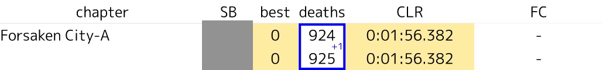
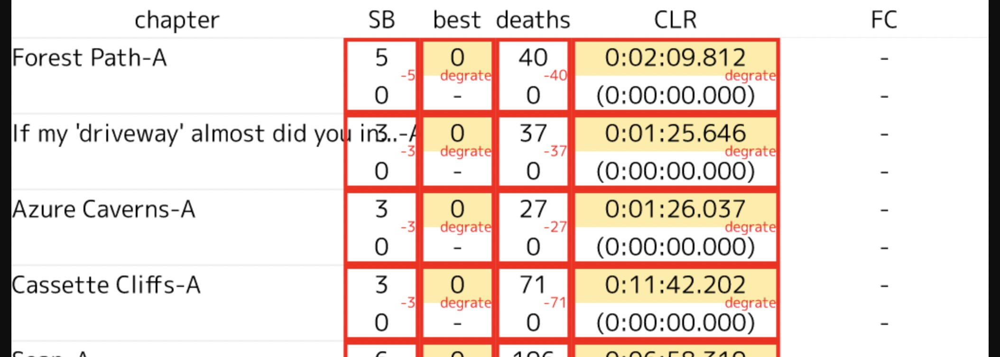
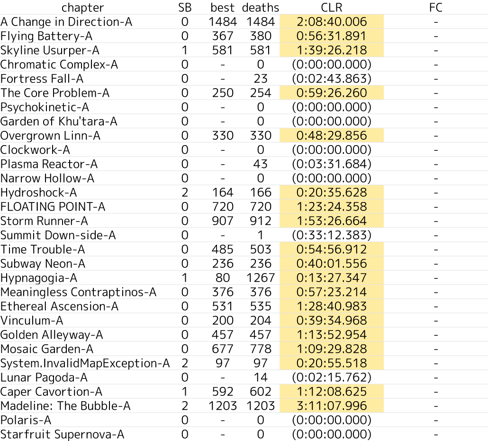

# Celeste Discord Botの使い方

## アップロードするCelesteのセーブデータについて

Steamであれば、SteamのライブラリのCelesteを右クリックして「ローカルファイルを閲覧」、Savesに入っている`0.celeste`などの`n.celeste`がセーブファイルです。

## `~update`

`~update`コマンドと合わせてアップロードするセーブデータをまとめて送信します。(セーブデータは自動でマージされます)

`apply`で変更を適用、`dismiss`で棄却します。

### 注意

セーブデータのアップロードし忘れで、以下のように赤く表示される場合があります。赤く表示された場合は、デス数が減ったり、タイムが増えたりした時なので、確認するようにしてください。

## `~load`

現在登録されているセーブデータを確認できます。

- SB: イチゴの数
- best: 最小デス数
- deaths: 累計デス数
- CLR: クリアタイム
  - `[xx:yy:zz]`: 一回で走り切らなかった場合の参考記録、マップの総プレイ時間
  - `(xx:yy:zz)`: クリアしていない、マップの総プレイ時間
- FC: フルクリアタイム

